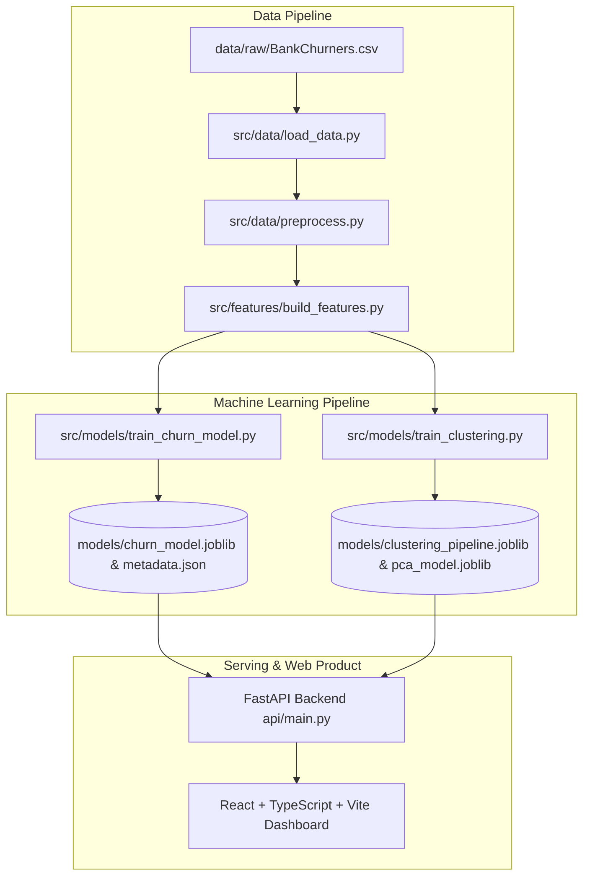

# Credit Card Customer Churn & Segmentation Intelligence

[](https://www.python.org/)
[](https://fastapi.tiangolo.com/)
[](https://react.dev/)
[](https://scikit-learn.org/)
[](https://opensource.org/licenses/MIT)

> An end-to-end, portfolio-grade Data Science and Machine Learning engineering project combining **formal statistical inference**, **interpretable supervised learning (Logistic Regression)**, **unsupervised customer segmentation (K-Means & PCA)**, and a **FastAPI + React analytical dashboard**.

---

## 1. Executive Summary & Business Context

In consumer banking, customer attrition directly destroys credit card revenue streams: interest margins on revolving balances, interchange swipe fees, and annual card fees. Simultaneously, customer acquisition costs (CAC) in retail banking typically exceed annual retention costs by **5x to 7x**.

However, predicting churn alone is insufficient. Retention executives need to know:
1. **Who is at risk of leaving?** (Calibrated churn probability $P(\text{Churn} = 1 \mid X)$)
2. **Why are they at risk?** (Interpretable odds ratios and behavioral change indicators)
3. **What natural customer segments exist, and what targeted retention strategies apply to each?** (Unsupervised behavioral clustering)

This project intentionally prioritizes **rigorous statistical reasoning, zero-leakage pipeline design, and high interpretability** over opaque black-box models.

---

## 2. Dataset Overview

The project uses the canonical **Bank Churners / Credit Card Customers** dataset:

- **10,127 accounts**
- **21 features** (Demographic, Relationship, Engagement, Financial, and Transactional)
- **Target Variable**: `Attrition_Flag`
  - `Existing Customer` (0): 8,500 accounts (83.93%)
  - `Attrited Customer` (1): 1,627 accounts (16.07%)
- **Class Imbalance**: ~16.1% churn rate creates an important **Accuracy Paradox** (a dummy baseline guessing "Existing Customer" achieves 84.0% accuracy while capturing 0% of churners).
- `CLIENTNUM` is strictly isolated as an account identifier and excluded from all feature matrices.

A complete machine-readable data dictionary is maintained in [`data/processed/data_dictionary.json`](data/processed/data_dictionary.json) and [`data/processed/DATA_DICTIONARY.md`](data/processed/DATA_DICTIONARY.md).

---

## 3. Core Research Questions & Hypotheses

| Research Question | Statistical Method | Empirical Finding | Business Conclusion |
|---|---|---|---|
| **RQ1 & H1: Inactivity** | Mann-Whitney U Test | $p = 1.6 \times 10^{-22}$, Cohen's $d = +0.33$ | Cardholders with 3+ inactive months show elevated attrition odds. |
| **RQ2 & H2: Transaction Velocity** | Mann-Whitney U Test | $p < 10^{-250}$, Cohen's $d = -1.09$ (Large) | Attrited accounts average **44.9 swipes/yr** vs **68.7** for retained. |
| **RQ3 & H3: Transaction Momentum** | Welch's t-test | $p = 7.2 \times 10^{-173}$, Cohen's $d = -0.83$ | A steep quarterly drop in transaction count ($Q4/Q1 < 0.60$) strongly signals attrition. |
| **RQ4 & H4: Relationship Depth** | Mann-Whitney U Test | $p = 3.8 \times 10^{-52}$, Cohen's $d = -0.39$ | Accounts with $\le 2$ banking products are significantly more vulnerable. |
| **RQ5 & H5: Support Contacts** | Mann-Whitney U Test | $p = 2.4 \times 10^{-83}$, Cohen's $d = +0.47$ | Frequent bank contacts ($\ge 4$/yr) reflect unresolved customer friction. |
| **RQ6 & H6: Demographics vs Behavior** | Chi-Square / Cramér's V | Cramér's $V < 0.04$ for demographics vs $d > 1.0$ for transactions | **Behavioral momentum heavily dominates demographic factors**. |
| **RQ7–RQ10: Natural Segments** | K-Means + PCA | Optimal $k=4$ clusters; post-hoc churn ranges from 5.4% to 26.9% | Natural behavioral groups have vastly different churn risk profiles. |

> **Note on Causality:** All statistical tests quantify empirical associations in observational historical data. Significant p-values confirm measurable dependence but do not imply direct causation.

---

## 4. Architecture & Pipeline Design



### Zero-Leakage Preprocessing
- Stratified 80/20 train/test split (`random_state=42`).
- Feature engineering transformer (`FeatureEngineer`) calculates:
  - Average transaction value: $\frac{\text{Total\_Trans\_Amt}}{\text{Total\_Trans\_Ct}}$
  - Annualized transaction rate: $\frac{\text{Total\_Trans\_Ct}}{\text{Months\_on\_book}}$
  - Annualized spend velocity: $\frac{\text{Total\_Trans\_Amt}}{\text{Months\_on\_book}}$
  - Normalized inactivity ratio: $\frac{\text{Months\_Inactive\_12\_mon}}{12.0}$
  - Severe quarterly drop flags: $Q4/Q1 < 0.60$
- `ColumnTransformer` fits numerical scaling (`StandardScaler`) and categorical encoding (`OneHotEncoder(drop='first', handle_unknown='ignore')`) strictly on the training partition.

---

## 5. Supervised Learning Results (Logistic Regression)

Evaluating models solely by accuracy on imbalanced datasets is misleading. Our model was evaluated via **Stratified 5-Fold Cross-Validation** and an untouched holdout test set ($N = 2,026$).

### Benchmark Comparison

| Model | Decision Threshold | Accuracy | Precision | Recall (Sensitivity) | F1 Score | ROC-AUC | Top-10% Lift |
|---|:---:|:---:|:---:|:---:|:---:|:---:|:---:|
| **Dummy Baseline (Most Frequent)** | 0.50 | 83.96% | 0.0% | 0.0% | 0.000 | 0.500 | 1.00x |
| **Balanced Logistic Regression (Default)** | 0.50 | 87.17% | 56.87% | **82.77%** | 0.674 | **0.934** | **5.25x** |
| **Balanced Logistic Regression (Optimal F1)** | **0.75** | **91.21%** | **74.92%** | **68.00%** | **0.713** | **0.934** | **5.25x** |

### Key Business Metrics
- **Top-Decile Lift (Lift@10%)**: **5.25x**. Contacting the highest-risk 10% of cardholders identifies **52.31% of all churners** with an **84.16% precision**.
- **Decision Threshold Flexibility**: Depending on campaign economics (cost of retention offer vs lifetime value of retained cardholder), the operational threshold can be tuned dynamically from 0.05 to 0.95.

### Model Coefficients & Odds Ratios ($e^\beta$)

| Feature | Standardized Coeff ($\beta$) | Odds Ratio ($e^\beta$) | Interpretation |
|---|:---:|:---:|---|
| `Contacts_Count_12_mon` | **+0.5955** | **1.81x** | Each std dev increase in service contacts increases churn odds by 81%. |
| `inactivity_ratio` | **+0.2707** | **1.31x** | Prolonged inactivity amplifies attrition risk by 31%. |
| `declining_trans_ct_flag` | **+0.1897** | **1.21x** | A drop $>40\%$ in quarterly transaction volume multiplies churn odds by 1.21x. |
| `Total_Trans_Ct` | **-1.1650** | **0.31x** | High annual transaction volume reduces churn odds by 69%. |
| `Total_Relationship_Count`| **-0.6284** | **0.53x** | Each std dev increase in banking products cuts churn odds by 47%. |
| `Total_Revolving_Bal` | **-0.5568** | **0.57x** | Active revolving balance holders are 43% less likely to attrite. |
| `Total_Ct_Chng_Q4_Q1` | **-0.5042** | **0.60x** | Healthy transaction momentum significantly protects retention. |

---

## 6. Unsupervised Customer Segmentation (K-Means & PCA)

Clustering was performed exclusively on standardized behavioral and financial features without the `Attrition_Flag` target:
- Features: `Total_Trans_Amt`, `Total_Trans_Ct`, `Total_Amt_Chng_Q4_Q1`, `Total_Ct_Chng_Q4_Q1`, `Months_Inactive_12_mon`, `Contacts_Count_12_mon`, `Total_Relationship_Count`, `Credit_Limit`, `Avg_Utilization_Ratio`.
- Cluster Count Selection: Evaluated $k \in [2, 6]$ via Elbow (Inertia) and Silhouette Scores ($k=4$ yielded the most coherent business structure).
- Post-hoc analysis shows **dramatic divergence in churn rate across segments**:

```text
┌──────────────────────────────────────────────────────────────────────────────────┐
│ Discovered Customer Segments                                                     │
├──────────────────────────────────────────────────────────────────────────────────┤
│ Cluster 0: Accelerating Growth Customers   │ 12.1% share │ Churn:  5.4% (Lowest) │
│ Cluster 1: High-Utilization Revolvers      │ 31.7% share │ Churn:  8.1% (Low)    │
│ Cluster 2: Disengaged & Underutilized      │ 43.0% share │ Churn: 26.9% (High)   │
│ Cluster 3: High-Volume Power Spenders      │ 13.2% share │ Churn:  9.6% (Stable) │
└──────────────────────────────────────────────────────────────────────────────────┘
```

### Segment Profiles & Playbooks

1. **Disengaged & Underutilized (At-Risk)** (`Cluster 2` — 43.0% of portfolio):
   - *Profile:* Very low credit utilization (8.7%), sharp drop in transactions ($Q4/Q1 = 0.617$), highest contact rate (2.7 calls/yr), and a **26.9% churn rate** (captures 72% of all portfolio churners).
   - *Strategy:* Automated win-back prompts, fee adjustments, service friction reviews.
2. **High-Utilization Credit Revolvers** (`Cluster 1` — 31.7% of portfolio):
   - *Profile:* High credit utilization (60.2%), steady transaction volume (67.1 swipes/yr), moderate limit ($2,871), and low churn (8.1%).
   - *Strategy:* Credit line increases, auto-pay discounts, low-APR promotional balance transfers.
3. **Accelerating Growth Customers** (`Cluster 0` — 12.1% of portfolio):
   - *Profile:* Accelerating quarterly spend ($Q4/Q1 = 1.096$), deep product holdings (4.5 products), and the lowest churn in the portfolio (**5.4%**).
   - *Strategy:* Premium tier upgrades, mortgage and investment cross-selling.
4. **High-Volume Power Spenders** (`Cluster 3` — 13.2% of portfolio):
   - *Profile:* Highest spend volume (~$9,933/yr), 88.5 transactions/yr, high credit limits ($10,648), and low churn (9.6%).
   - *Strategy:* Concierge lifestyle perks, airline/hotel partner transfers, tier status retention.

### Principal Component Analysis (PCA)
- **PC1 (23.3% variance)**: Captures transaction velocity and spend volume.
- **PC2 (17.0% variance)**: Captures credit line capacity and utilization ratio.
- Total explained variance across 2 components: **40.3%**, producing an interpretable 2D projection of portfolio customer density.

---

## 7. Interactive Web Application

The project includes an enterprise-grade banking intelligence dashboard:

- **Executive Overview**: Portfolio metrics, segment attrition comparisons, target class distribution, and 2D PCA cluster scatter plot.
- **Churn Risk Simulator**: Interactive 21-feature input form, one-click persona presets ("High Risk Attriter", "Loyal Spender", etc.), real-time risk gauge, risk tier badges, and key driver explanations.
- **Customer Segments**: Detailed cluster cards, KPI grids, comparative spend vs churn charts, and strategic retention playbooks.
- **Model Performance**: Confusion matrix, interactive threshold slider (0.05 to 0.95), ROC and Precision-Recall curves, baseline comparison table, and standardized odds-ratio chart.
- **Data & Statistical Insights**: Formal hypothesis test tables with test statistics, p-values, 95% CIs, and plain-English interpretations.
- **Customer Explorer**: Paginated, searchable, and sortable database of all 10,127 customer accounts with filterable risk tiers and slide-out deep-dive drawer.

---

## 8. Repository Structure

```text
churn_project/
│
├── data/
│   ├── raw/
│   │   └── BankChurners.csv              # Canonical 10,127-customer dataset
│   └── processed/
│       ├── train.csv                     # Stratified 80% training split
│       ├── test.csv                      # Untouched 20% holdout test split
│       ├── customer_intelligence.csv     # Combined customer scoring & segment dataset
│       ├── data_dictionary.json          # Machine-readable data dictionary
│       ├── statistical_tests.json        # Exact p-values, CIs, effect sizes
│       └── eda_summary.json              # Pre-computed EDA metrics
│
├── notebooks/
│   ├── 01_data_understanding.ipynb       # Ingestion, validation, data dictionary
│   ├── 02_eda.ipynb                      # Univariate & bivariate exploratory analysis
│   ├── 03_statistical_analysis.ipynb     # Hypothesis testing (Chi-Square, Mann-Whitney)
│   ├── 04_feature_engineering.ipynb      # Derivations, multicollinearity, pipelines
│   ├── 05_churn_model.ipynb              # Baseline, Logistic Regression, thresholding
│   └── 06_customer_segmentation.ipynb    # K-Means, Silhouette, PCA, cluster profiling
│
├── src/
│   ├── data/
│   │   ├── load_data.py                  # Dataset acquisition and validation
│   │   ├── preprocess.py                 # Split data, ColumnTransformer builder
│   │   └── statistical_analysis.py       # Formal hypothesis testing engine
│   ├── features/
│   │   └── build_features.py             # FeatureEngineer Scikit-Learn transformer
│   ├── models/
│   │   ├── train_churn_model.py          # Supervised training & evaluation
│   │   └── train_clustering.py           # Unsupervised K-Means & PCA engine
│   ├── evaluation/
│   │   └── metrics.py                    # ROC, PR, threshold sweep, lift metrics
│   └── utils/
│       └── helpers.py                    # Constants, paths, NpEncoder, logging
│
├── models/
│   ├── churn_model.joblib                # Serialized Logistic Regression pipeline
│   ├── clustering_pipeline.joblib        # Serialized K-Means pipeline
│   ├── pca_model.joblib                  # Serialized PCA transformer
│   ├── model_metadata.json               # Trained metrics, curves, odds ratios
│   └── cluster_profiles.json             # Segment metrics, PCA loadings & sample
│
├── api/
│   ├── main.py                           # FastAPI application & SPA mounting
│   └── schemas.py                        # Pydantic input/output schemas
│
├── frontend/                             # React + TypeScript + Vite dashboard
│   ├── src/
│   │   ├── components/                   # Navbar, Overview, Predictor, Segments, etc.
│   │   ├── services/api.ts               # Backend API client
│   │   ├── types/api.ts                  # TypeScript interfaces
│   │   ├── App.tsx                       # Main application shell
│   │   └── index.css                     # Banking design system tokens
│   └── dist/                             # Compiled production bundle
│
├── tests/
│   ├── test_data_processing.py           # Feature engineering & split tests
│   ├── test_models.py                    # Pipeline inference & shape tests
│   └── test_api.py                       # FastAPI integration tests
│
├── scripts/
│   └── generate_notebooks.py             # Notebook generation automation
│
├── requirements.txt
├── pyproject.toml
├── PROJECT_SPEC.md
└── README.md
```

---

## 9. Local Reproduction & Quickstart

### Prerequisites
- Python 3.10+ (tested on Python 3.13)
- Node.js 18+ and npm

### 1. Clone & Set Up Python Environment
```bash
git clone https://github.com/noamschwartz/churn_project.git
cd churn_project

# Create and activate virtual environment
python3 -m venv venv
source venv/bin/activate

# Install Python dependencies
pip install -r requirements.txt
```

### 2. Execute Pipeline & Train Models
```bash
# Load data & validate
python -m src.data.load_data

# Run statistical hypothesis tests & generate summaries
python -m src.data.statistical_analysis

# Train Logistic Regression & optimize threshold
python -m src.models.train_churn_model

# Fit K-Means clustering & PCA
python -m src.models.train_clustering
```

### 3. Run Automated Tests
```bash
pytest tests/ -v
```

### 4. Launch Application

#### Option A: Unified Single Server (FastAPI serves API + compiled React SPA)
```bash
# The pre-built React bundle in frontend/dist/ is automatically served at root
uvicorn api.main:app --host 0.0.0.0 --port 8000
```
Visit **`http://localhost:8000`** in your browser. API Swagger documentation is available at **`http://localhost:8000/docs`**.

#### Option B: Vite Development Server
```bash
# Terminal 1: Launch Backend
uvicorn api.main:app --host 0.0.0.0 --port 8000 --reload

# Terminal 2: Launch Frontend
cd frontend
npm install
npm run dev
```
Visit **`http://localhost:5173`** for live-reloading frontend development.

---

## 10. Methodological Limitations & Future Work

1. **Observational Nature of Data**: Historical bank records reveal strong associations (e.g. low transaction volume $\to$ churn), but cannot prove whether disengagement is caused by competitive pricing, service dissatisfaction, or external life events.
2. **Static Snapshot vs Dynamic Time Series**: The dataset records aggregated 12-month metrics and Q4/Q1 ratios rather than monthly transaction sequences. Future iterations could incorporate survival analysis (Cox Proportional Hazards) to predict *time-to-churn*.
3. **Threshold Calibration**: Operational deployment requires incorporating customer lifetime value ($LTV$) and outreach unit cost ($C_{contact}$) to compute the mathematically optimal financial decision threshold:
   $$\text{Threshold}^* = \frac{C_{contact}}{LTV \times \text{Success Rate}}$$

---

## 11. Author & License

Created by **Noam Schwartz** as a portfolio Data Science project.  
Released under the [MIT License](LICENSE).
# churn_project
