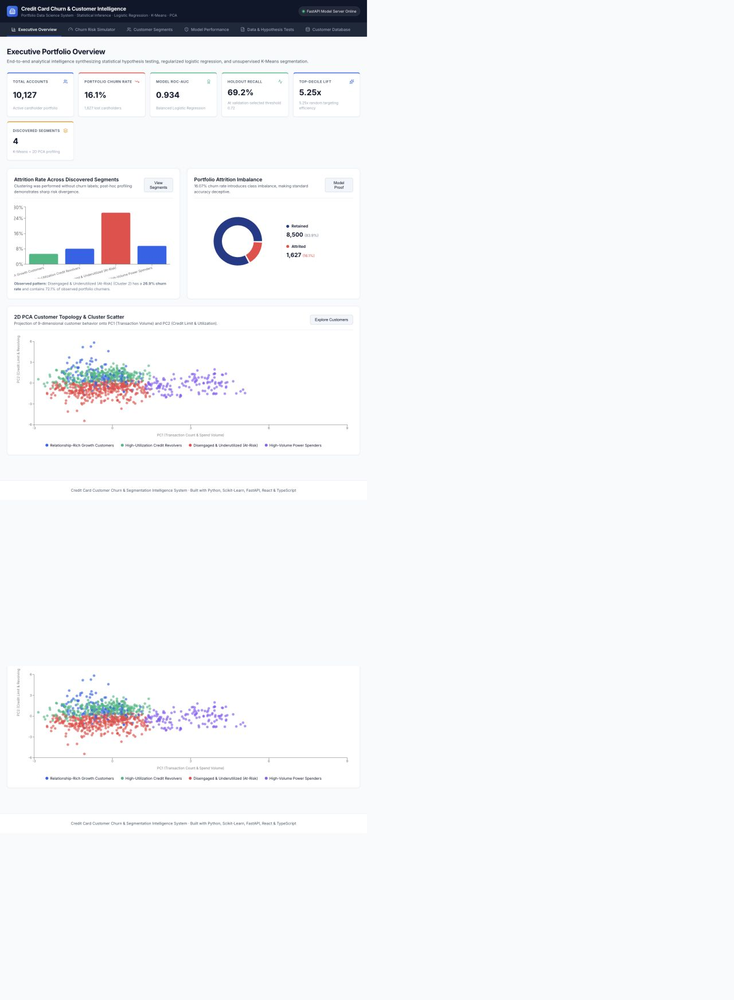
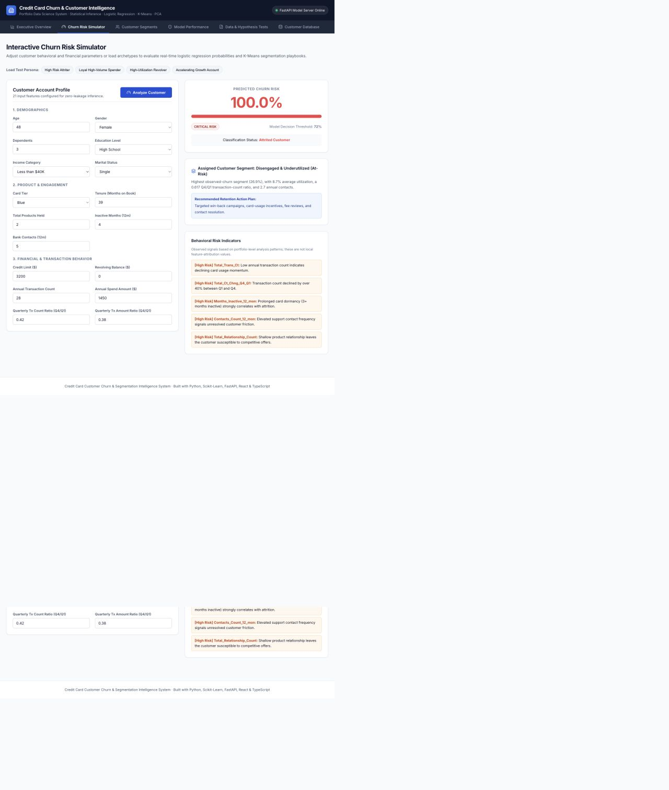
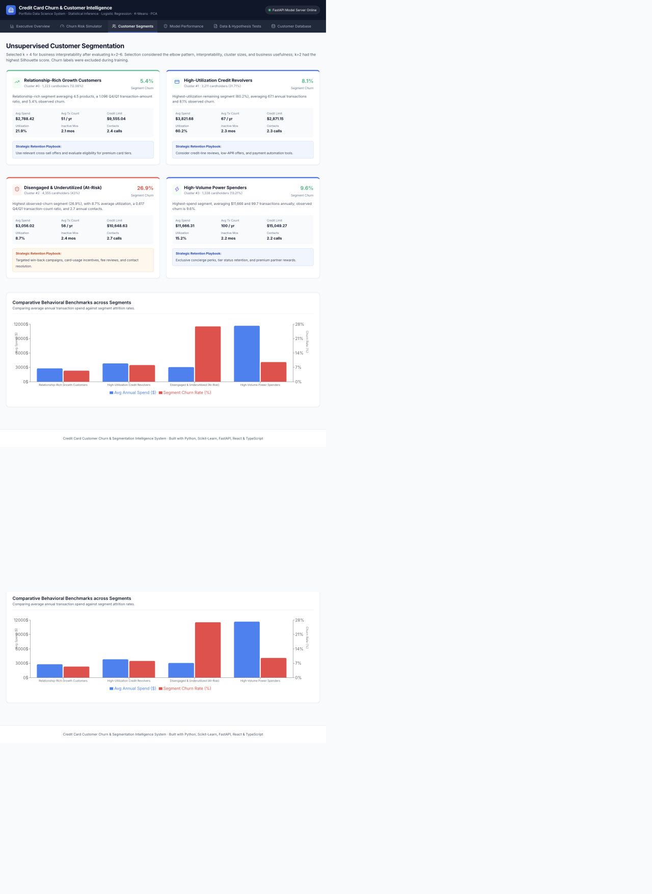
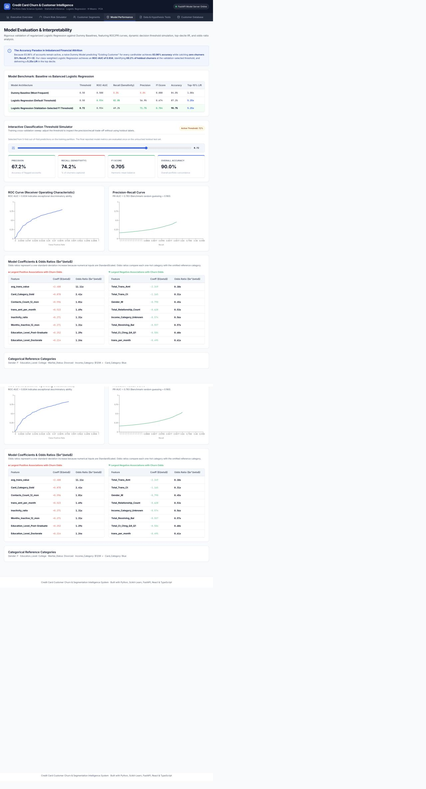
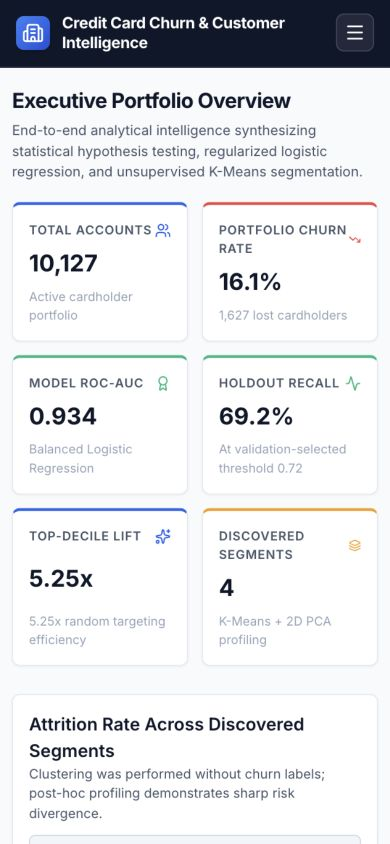
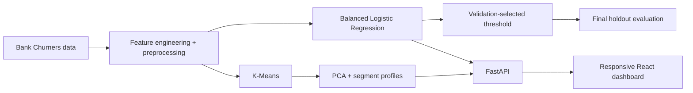

# Credit Card Churn & Customer Intelligence

[](https://www.python.org/)
[](https://fastapi.tiangolo.com/)
[](https://react.dev/)
[](#verification)

**Live demo:** deployment URL will be added here immediately after the first Vercel deployment.

[](https://vercel.com/new/clone?repository-url=https%3A%2F%2Fgithub.com%2Fnoamsch5%2Fchurn_project)



## At a glance

This project identifies credit-card accounts associated with elevated churn risk and groups customers into actionable behavioral segments. It uses the historical Bank Churners dataset (10,127 accounts, 16.1% attrition), a class-weighted Logistic Regression classifier, and K-Means with PCA for exploratory segmentation.

| Area | Result |
|---|---|
| Dataset | 10,127 accounts; 19 model inputs; 16.1% observed churn |
| Classifier | Class-weighted Logistic Regression |
| Official evaluation | Untouched 20% holdout test set, n = 2,026 |
| ROC-AUC / PR-AUC | **0.934 / 0.763** |
| Recall / precision at selected threshold | **69.2% / 71.7%** |
| Top-decile lift | **5.25x** |
| Segmentation | **Selected k = 4** after evaluating k = 2–6 |
| Visualization | PCA 2D projection explains **40.3%** of variance |
| Product | Responsive FastAPI + React/TypeScript dashboard |

The model returns a **churn probability / churn risk score**. It is not described as calibrated because no probability-calibration procedure has been fitted or evaluated.

## Methodology

### Leakage-safe model and threshold evaluation

The data is split once into stratified training (80%) and holdout test (20%) partitions.

1. Preprocessing, feature engineering, and Logistic Regression are evaluated with stratified five-fold cross-validation on training data.
2. The operating threshold is selected by maximizing F1 on five-fold **out-of-fold training predictions**.
3. The model is refit on the complete training partition.
4. The fixed model and fixed threshold are evaluated once on the untouched holdout test set.

The selected threshold is **0.72**. The API, dashboard, metadata, and exported customer classifications all use this threshold.

| Holdout result | Threshold | Accuracy | Precision | Recall | F1 | ROC-AUC | Lift@10% |
|---|---:|---:|---:|---:|---:|---:|---:|
| Default cutoff comparison | 0.50 | 87.17% | 56.87% | 82.77% | 0.674 | 0.934 | 5.25x |
| Validation-selected cutoff | **0.72** | **90.67%** | **71.66%** | **69.23%** | **0.704** | **0.934** | **5.25x** |

Threshold choice is ultimately a business decision: outreach cost, customer value, intervention success rate, and the cost of a missed churner should determine the production cutoff.

### Coefficients and odds ratios

Numerical inputs are standardized. Their odds ratios therefore represent a **one-standard-deviation increase**, not a one-unit increase. For categorical one-hot features, each odds ratio compares that category with its omitted reference category:

| Feature | Reference category |
|---|---|
| Gender | F |
| Education Level | College |
| Marital Status | Divorced |
| Income Category | \$120K + |
| Card Category | Blue |

Coefficients describe conditional associations in this fitted model; they are not causal effects or local feature attributions.

### Customer segmentation

K-Means was trained on nine standardized behavioral and financial variables without using the churn label. **Selected k = 4 for business interpretability after evaluating k = 2–6.**

| k | Inertia | Silhouette |
|---:|---:|---:|
| 2 | 77,490.66 | **0.2196** |
| 3 | 67,905.89 | 0.1520 |
| 4 | 62,294.94 | 0.1513 |
| 5 | 57,717.06 | 0.1427 |
| 6 | 53,735.66 | 0.1435 |

k = 2 has the highest Silhouette score, so k = 4 is not presented as an unambiguous quantitative optimum. The final choice also considered:

- the elbow / diminishing inertia improvement;
- interpretable behavioral profiles;
- usable cluster sizes;
- usefulness for differentiated retention strategies.

Current profiles are generated from retrained cluster metadata rather than hard-coded numerical copy:

| Segment | Portfolio share | Observed churn |
|---|---:|---:|
| Relationship-Rich Growth Customers | 12.08% | 5.40% |
| High-Utilization Credit Revolvers | 31.71% | 8.10% |
| Disengaged & Underutilized (At-Risk) | 43.00% | 26.93% |
| High-Volume Power Spenders | 13.21% | 9.57% |

### Statistical analysis

The analysis reports effect sizes and confidence intervals alongside hypothesis tests. Benjamini-Hochberg false-discovery-rate correction is applied across the 22 primary categorical chi-square and numerical Mann-Whitney tests at α = 0.05.

All findings are framed as **associations in observational historical data**. They do not show that any feature causes churn.

## Demo prediction scope

[customer_intelligence.csv](data/processed/customer_intelligence.csv) contains demo scores for all 10,127 accounts. Each row is explicitly marked as either:

- `holdout_test`: out-of-sample for the final fitted model evaluation; or
- `training_in_sample_demo`: scored for product demonstration, not an out-of-sample claim.

Official reported metrics use only the holdout test set. The dashboard’s “Behavioral Risk Indicators” are transparent heuristics based on portfolio-level analysis patterns, not SHAP values or another local attribution method.

## Product screenshots

| Churn prediction | Customer segments |
|---|---|
|  |  |

### Model performance



### Responsive mobile navigation



## Architecture



Key locations:

- `src/models/train_churn_model.py`: cross-validation, threshold selection, holdout evaluation, metadata
- `src/models/train_clustering.py`: k evaluation, clustering, PCA, data-derived profiles, customer export
- `src/data/statistical_analysis.py`: association tests, effect sizes, FDR correction
- `api/main.py`: inference and analytics endpoints
- `frontend/`: responsive dashboard
- `notebooks/`: reproducible analysis notebooks
- `tests/`: data processing, inference, clustering, and API tests

## Local reproduction

Prerequisites: Python 3.10+, Node.js 18+, and npm.

```bash
git clone https://github.com/noamsch5/churn_project.git
cd churn_project

python3 -m venv .venv
source .venv/bin/activate
python -m pip install -r requirements.txt

# Rebuild all analytical artifacts (the raw dataset downloads if absent)
python -m src.data.load_data
python -m src.data.statistical_analysis
python -m src.models.train_churn_model
python -m src.models.train_clustering

# Build the dashboard and run the unified application
npm --prefix frontend ci
npm --prefix frontend run build
uvicorn api.main:app --host 0.0.0.0 --port 8000
```

Open [http://localhost:8000](http://localhost:8000). API documentation is at [http://localhost:8000/docs](http://localhost:8000/docs).

For frontend development, run `npm --prefix frontend run dev`; Vite proxies API routes to the local FastAPI server.

## Deploy to Vercel

The repository is configured as one Vercel FastAPI project. During deployment, Vercel builds the React frontend and packages its static output together with the API, model artifacts, metadata, and customer-intelligence data. The browser uses same-origin API requests, so no production API URL or CORS environment variable is required.

1. Open the **Deploy with Vercel** button above, or import `noamsch5/churn_project` from the Vercel dashboard.
2. Leave the project root as the repository root. `vercel.json` and `pyproject.toml` provide the framework, build command, and Python entrypoint.
3. Deploy without adding environment variables.
4. Replace the **Live demo** placeholder at the top of this README with the resulting production URL.

## Verification

```bash
pytest -q
npm --prefix frontend run lint
npm --prefix frontend run build
```

**All automated tests passing.** A clean-copy reproduction also verifies dependency installation, artifact loading, API startup, and production frontend build without relying on ignored local files.

## Limitations

- The dataset is historical and observational; results support associations, not causal conclusions.
- Dataset size and provenance are limited to one public snapshot of 10,127 accounts.
- The selected threshold is validation-based but should change with real business costs and intervention capacity.
- K-Means segmentation is exploratory and depends on feature selection, scaling, k, and random initialization.
- The two-dimensional PCA view explains only about 40.3% of total variance.
- Scores are not probability-calibrated.
- Multiple-testing correction reduces false discoveries but does not remove selection bias or guarantee external validity.

## Future improvements

- Evaluate Platt or isotonic calibration with calibration curves and Brier score.
- Compare a small set of alternative classifiers under the same validation protocol.
- Add SHAP or another genuine local explanation method.
- Add model and data-drift monitoring.
- Use temporal validation on longitudinal account histories.

## License

MIT © 2026 Noam Schwartz.
